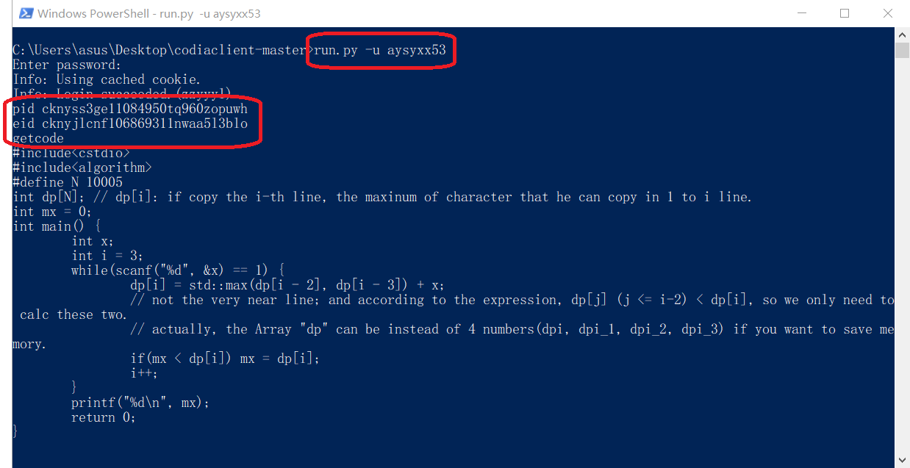

如果想要了解客户端的用法，可以用`run.py -h`来获得*命令帮助*，登录后可以在窗口输入`help`获得*查询帮助*.

# 输出信息解释

客户端的输出信息分为四种，错误级别从低到高分别为`Info`, `Warning`, `Error`, `Fatal`.

`Info`指程序正常运行中产生的消息;

`Warning`指可能导致程序结束/出错的警告消息;

`Error`指不影响程序整体运行的错误消息;

`Fatal`指严重出错导致程序无法进行的错误消息.

|常见错误/警告信息|解释|建议|
|----------------|----|----|
|`Fatal: Empty password.`|密码未输入|依据提示输入密码|
|`Fatal: Invalid cookie input.`|`cookie`不合法|检查你的`cookie`|
|`Fatal: Login failed.`|登陆失败|检查你的登录凭证|
|`Fatal: No username or cookie specified.`|用户名未输入|按照正确格式输入用户名|
|`Warning: _login: invalid username or password.`|用户名不存在或密码错误|检查你的用户名和密码|
|`Warning: Connect timeout.`|网络连接超时|检查你的计算机网络连接，或稍后重试|
|`Warning: Connection error.`|网络连接错误|检查你的计算机网络连接|
|`Warning: Invalid request.`|非法请求|检查你的请求格式，可以在程序内`help`以获得帮助|
|`Warning: No pid specified.`|未指定题包`pid`|按照正确格式输入`pid`|
|`Warning: No eid specified.`|未指定题目`eid`|按照正确格式输入`eid`|

# 常用功能

## 登录

按照正确格式输入账号密码，格式可以是 ：

`run.py -u USERNAME --passwd PASSWORD`（会在窗口中显示密码）

或

`run.py -u USERNAME`后依据提示输入密码（不会在窗口中显示密码，建议使用这种方式）

如果网络畅通并且账号验证成功，客户端会提示`Info: Login succeeded.(DisplayName)`，其中`DisplayName`是你的昵称。这表示你已经登录成功。

## 获取题包列表/信息

### 获取题包列表

`getpack` 或 `gp`.

返回类型为`json`.

在这里可以看到题包标题和`pid`等信息.

你也可以采用`getpack N`的形式来获取最近的`N`个题包，默认为8.

### 获取题包信息（需先指定题包）

`showpack` 或 `sp`.

返回类型为`json`.

在这里可以看到题包的一些信息，包括题包起止时间、题目标题和`eid`等信息.

## 指定题包/题目

这个过程不需要联网，因为这一步程序并不会检查ID的合法性。这也使得可能你输入了错误的ID导致后续无法获取想要的结果。

### 指定题包

指定题包需通过`pid`指定。

`pid PID` 或 `p PID`.

### 指定题目

指定题目需通过`eid`指定。

`eid EID` 或 `e EID`.

## 查看题目内容

`getexercise` 或 `ge`.

该函数可以指定返回类型，直接调用默认为`dict`，在查询时默认为`json`.

## 提交代码

1. 打开文件

`open PATH`

读取路径上的文件内容并写入到变量`solutioncode`中.

2. 提交

`submit`.

直接调用函数的返回类型为`requests.Response`，查询时没有返回.

根据`pid`, `eid`的值确定提交的题目，并以`solutioncode`的值作为提交的代码.

## 查询提交过的代码

1. 指定`pid`（可能不用，视情况而定）和`eid`；

题目`pid`与`eid`可以通过客户端查询，或者在网页端访问的链接中获得.

网页链接中，`/pack/`后面的字符串为`pid`，`/exercise/`后面的字符串为`eid`，如果没有`pack`字段，则不需要指定`pid`.

例如在`https://code.bdaa.pro/pack/cknyss3ge11084950tq960zopuwh/exercise/cknyjlcnf106869311nwaa5l3blo/coding`中，

`cknyss3ge11084950tq960zopuwh` 为 `pid`，

`cknyjlcnf106869311nwaa5l3blo` 为 `eid`.

2. 获取代码；

`getcode` 或 `gc`.

返回类型为`str`.

这行代码会获取最近一次提交的代码.

想要获得倒数第K次的代码，还可以通过`getcode K`来实现.

若想将代码输出到文件，可以采用`getcode to PATH`的形式。例如：`getcode to temp.cpp`

## 查询代码评判结果

1. 指定`pid`（可能不用，视情况而定）和`eid`；

2. 获取结果

`getreport` 或 `gr`.

返回类型为`json`.

这行代码会获取最近一次提交的代码的评判结果。如果仍在评判中，会返回空字典，即`{}`.

想要获得倒数第K次的评判结果，还可以通过`getreport K`来实现.

## 查看程序运行中的变量

1. 查看全部变量

`show`.

返回类型为`json`.

2. 查看某个变量

`show VAR`.

返回类型为`json`.

特别地，`open`过的代码存放在`solutioncode`变量中，可以用`show solutioncode`或`show sc`查看.

## 例子

